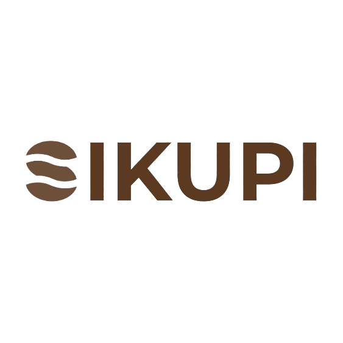

# 🌱 Sikupi - AI-Powered Coffee Grounds Marketplace

<div align="center">



**🏆 Winner of the 11th UTU Awards Competition - Marketplace Design Category**

[](https://www.sikupi.com/)
[](https://nextjs.org/)
[](https://www.typescriptlang.org/)
[](https://supabase.com/)
[](https://openai.com/)

</div>

## 🎉 Competition Achievement

This project was proudly developed for the **11th UTU Awards Competition** in the **Marketplace Design** category and successfully secured **first place**, bringing home **15 Million IDR** in prize money! This achievement represents the culmination of innovative design, cutting-edge technology, and sustainable business practices.

---

## 🚀 Overview

**Sikupi** is a revolutionary AI-powered marketplace that transforms coffee waste into valuable resources, creating a circular economy ecosystem in Banda Aceh. By connecting coffee shops, cafes, and waste generators with buyers seeking sustainable products, Sikupi addresses environmental challenges while creating economic opportunities.

### 🌟 What Makes Sikupi Special

- **🤖 AI-Powered Analysis**: Advanced computer vision for coffee grounds quality assessment
- **♻️ Circular Economy**: Converting waste into valuable products and resources
- **🌍 Environmental Impact**: Reducing coffee waste while creating sustainable alternatives
- **💬 Smart Assistant**: 24/7 AI chatbot for customer support and product guidance
- **📱 Modern UX**: Intuitive, responsive design built with cutting-edge technologies

---

## 🏛️ Architecture & Technology Stack

### **Frontend Framework**
- **Next.js 15** with App Router for optimal performance and SEO
- **TypeScript** for type-safe development
- **Tailwind CSS** + **shadcn/ui** for beautiful, responsive design
- **Framer Motion** for smooth animations and interactions

### **Backend & Database**
- **Supabase** (PostgreSQL) with Row Level Security (RLS)
- **Supabase Auth** for secure authentication
- **React Server Components** for optimal data fetching

### **AI & Machine Learning**
- **OpenAI GPT** for intelligent chatbot interactions
- **OpenAI Vision** for coffee grounds quality analysis
- Custom prompts for domain-specific assistance

### **Payment & Shipping**
- **Midtrans** payment gateway (sandbox for demo)
- **Biteship** shipping integration with real-time tracking
- Automated order management and status updates

### **Additional Technologies**
- **React Hook Form** + **Zod** for robust form validation
- **TanStack Query** for efficient client-side data management
- **Radix UI** primitives for accessible components

---

## ✨ Key Features

### 🛍️ **Marketplace Core**
- **Product Catalog**: Browse coffee grounds (`ampas`) and derivative products (`turunan`)
- **Advanced Filtering**: Filter by type, category, grind level, condition, and more
- **Smart Search**: AI-enhanced product discovery
- **Shopping Cart**: Seamless cart management with real-time updates

### 🤖 **AI-Powered Features**

#### **Ampas Analyzer**
- Upload 1-3 images of coffee grounds
- AI determines coffee type (Arabica/Robusta/Mix)
- Analyzes grind level (Fine/Medium/Coarse)
- Estimates fair market price
- Provides quality recommendations

#### **SiKupiBot Assistant**
- 24/7 customer support
- Product recommendations
- Order assistance and tracking
- Educational content about circular economy

### 📦 **Order Management**
- **Real-time Tracking**: From order to delivery
- **Payment Integration**: Secure Midtrans payment processing
- **Shipping Automation**: Biteship integration with multiple courier options
- **Order History**: Complete transaction records

### ⭐ **Review System**
- **Verified Reviews**: Only completed orders can be reviewed
- **Rating System**: 1-5 star ratings with detailed comments
- **Product Insights**: Average ratings displayed on product pages

### 📖 **Sikupi Magazine**
- **Educational Content**: Articles about circular economy and sustainability
- **Industry Insights**: Coffee industry trends and innovations
- **DIY Guides**: Creative uses for coffee grounds
- **Admin Publishing**: Content management for administrators

### 🔧 **Admin Dashboard**
- **Product Management**: Create, edit, and manage inventory
- **Order Processing**: Track and update order statuses
- **Analytics**: Insights into sales and user behavior
- **Content Management**: Publish and edit magazine articles

---

## 🎯 Business Model

Sikupi operates as a **centralized marketplace** where:

1. **Sellers** (coffee shops, cafes) provide coffee waste through WhatsApp coordination
2. **Sikupi** processes, packages, and quality-controls the products
3. **Buyers** purchase through the platform with integrated payment and shipping
4. **Value Creation** through waste transformation and AI-enhanced user experience

### 🌱 Environmental Impact
- **Waste Reduction**: Diverting coffee grounds from landfills
- **Resource Creation**: Converting waste into useful products (fertilizer, animal feed, scrubs, briquettes)
- **Sustainable Economy**: Creating income streams from waste materials

---

## 🚀 Getting Started

### Prerequisites
- Node.js 18+ 
- npm or yarn
- Supabase account
- OpenAI API key
- Midtrans sandbox account
- Biteship API key

### Installation

1. **Clone the repository**
   ```bash
   git clone https://github.com/notsuperganang/sikupi.git
   cd sikupi
   ```

2. **Install dependencies**
   ```bash
   npm install
   ```

3. **Environment Setup**
   ```bash
   cp .env.example .env.local
   ```
   
   Configure your environment variables:
   ```env
   # Supabase
   NEXT_PUBLIC_SUPABASE_URL=your_supabase_url
   NEXT_PUBLIC_SUPABASE_ANON_KEY=your_anon_key
   SUPABASE_SERVICE_ROLE_KEY=your_service_role_key
   
   # OpenAI
   OPENAI_API_KEY=your_openai_api_key
   
   # Midtrans (Sandbox)
   MIDTRANS_SERVER_KEY=your_server_key
   MIDTRANS_CLIENT_KEY=your_client_key
   
   # Biteship
   BITESHIP_API_KEY=your_biteship_key
   
   # Warehouse
   NEXT_PUBLIC_WAREHOUSE_ORIGIN_CITY_ID=your_city_id
   ```

4. **Database Setup**
   ```bash
   # Apply database migrations
   node scripts/apply-migrations.js
   
   # Create admin user
   node scripts/create-admin.js
   
   # Seed sample products
   npm run seed
   ```

5. **Start Development Server**
   ```bash
   npm run dev
   ```

6. **Open your browser**
   Navigate to `http://localhost:3000`

### 🔧 Available Scripts

```bash
npm run dev          # Start development server
npm run build        # Build for production
npm run start        # Start production server
npm run lint         # Run ESLint
npm run seed         # Seed database with sample data
```

---

## 📱 User Interfaces

### **Customer Experience**
- **Product Discovery**: Intuitive browsing with smart filters
- **Product Details**: Comprehensive product information with AI insights
- **Checkout Flow**: Streamlined purchase process with multiple payment options
- **Order Tracking**: Real-time updates from purchase to delivery
- **AI Assistant**: Contextual help throughout the user journey

### **Admin Interface**
- **Dashboard**: Overview of sales, orders, and platform metrics
- **Product Management**: Easy inventory and catalog management
- **Order Processing**: Efficient order fulfillment workflow
- **Content Management**: Magazine article creation and publishing
- **Analytics**: Data-driven insights for business decisions

---

## 🏗️ System Architecture

```
┌─────────────────┐    ┌─────────────────┐    ┌─────────────────┐
│   Next.js App   │    │   Supabase DB   │    │   OpenAI API    │
│   (Frontend)    │◄──►│   (Backend)     │    │   (AI Models)   │
└─────────────────┘    └─────────────────┘    └─────────────────┘
         │                       │                       │
         ▼                       ▼                       ▼
┌─────────────────┐    ┌─────────────────┐    ┌─────────────────┐
│   Midtrans API  │    │   Biteship API  │    │   Admin Panel   │
│   (Payments)    │    │   (Shipping)    │    │   (Management)  │
└─────────────────┘    └─────────────────┘    └─────────────────┘
```

---

## 🏆 Competition Success

### **11th UTU Awards - Marketplace Design Category**

**🥇 First Place Winner** 
- **Prize**: 15 Million IDR
- **Category**: Marketplace Design
- **Achievement**: Recognized for innovation in sustainable marketplace design
- **Impact**: Demonstrating real-world application of circular economy principles

### **What Set Us Apart**
- **Innovation**: First AI-powered coffee waste marketplace in Indonesia
- **Sustainability**: Clear environmental and social impact
- **Technology**: Cutting-edge full-stack implementation
- **User Experience**: Intuitive design with AI enhancement
- **Business Model**: Viable circular economy solution

---

## 👨‍💻 Development Team

### **The Winning Team**

<table>
<tr>
<td align="center">
<br>
<b>Ganang Setyo Hadi</b><br>
<i>Fullstack Developer</i><br>
Informatics '22<br>
Universitas Syiah Kuala<br>
<br>
<a href="https://www.linkedin.com/in/ganang-setyo-hadi/">🔗 LinkedIn</a><br>
<a href="https://github.com/notsuperganang">💻 GitHub</a>
</td>
<td align="center">
<br>
<b>Alif Rizki Sahna</b><br>
<i>Designer</i><br>
Architecture '23<br>
Universitas Syiah Kuala<br>
<br>
UI/UX Design
</td>
<td align="center">
<br>
<b>Novia Ramadhani</b><br>
<i>Business Manager</i><br>
Management '22<br>
Universitas Syiah Kuala<br>
<br>
Business Strategy & Market Analysis
</td>
</tr>
</table>

### **Role Responsibilities**

- **Ganang Setyo Hadi**: Led full-stack development, AI integration, payment systems, and deployment
- **Alif Rizki Sahna**: Designed system architecture, user interface, and user experience flows
- **Novia Ramadhani**: Developed business model, market research, and competition strategy

---

## 🌐 Live Demo

**🔗 Visit Sikupi**: [www.sikupi.com](https://www.sikupi.com/)

### **Test Features**
- Browse products with AI-powered filtering
- Experience the Ampas Analyzer with sample images
- Chat with SiKupiBot for product recommendations
- Complete checkout flow (sandbox payments)
- Track orders with real shipping integration

---

## 📊 Project Statistics

- **Development Time**: 2 weeks (rapid prototyping)
- **Code Quality**: TypeScript for 100% type safety
- **AI Features**: 2 core AI integrations (analysis + chat)
- **API Integrations**: 3 external services (payments, shipping, AI)
- **Database Tables**: 15+ optimized tables with RLS
- **UI Components**: 50+ reusable React components

---

## 🔮 Future Development

### **Planned Features**
- **Multi-language Support**: Indonesian and English
- **Mobile App**: React Native implementation
- **Advanced Analytics**: ML-powered business insights
- **Seller Dashboard**: Direct seller onboarding and management
- **Marketplace Expansion**: Multiple cities and regions

### **Technical Roadmap**
- **Performance Optimization**: Image optimization and CDN integration
- **Security Enhancement**: Advanced authentication and authorization
- **Testing Suite**: Comprehensive unit and integration tests
- **Monitoring**: Advanced logging and error tracking

---

## 📄 License

This project is proprietary and was developed for the UTU Awards competition. 

**Copyright © 2024 Sikupi Team**
- Ganang Setyo Hadi
- Alif Rizki Sahna  
- Novia Ramadhani

---

## 🤝 Contributing

While this is a competition project, we welcome feedback and suggestions! Feel free to:

1. **Report Issues**: Found a bug? Let us know!
2. **Suggest Features**: Have ideas for improvement?
3. **Ask Questions**: Want to understand our approach?

Contact the development team through:
- **GitHub**: [@notsuperganang](https://github.com/notsuperganang)
- **LinkedIn**: [Ganang Setyo Hadi](https://www.linkedin.com/in/ganang-setyo-hadi/)
- **Website**: [sikupi.com](https://www.sikupi.com/)

---

## 🙏 Acknowledgments

### **Special Thanks**
- **Universitas Syiah Kuala** for supporting our innovation
- **UTU Awards Committee** for recognizing our project
- **Coffee Shop Partners** in Banda Aceh for their collaboration
- **Open Source Community** for the amazing tools and libraries

### **Technology Partners**
- [Supabase](https://supabase.com/) for backend infrastructure
- [OpenAI](https://openai.com/) for AI capabilities
- [Midtrans](https://midtrans.com/) for payment processing
- [Biteship](https://biteship.com/) for shipping solutions
- [Vercel](https://vercel.com/) and [Google Cloud](https://cloud.google.com/) for hosting

---

<div align="center">

**🌱 Building a Sustainable Future, One Coffee Ground at a Time**

Made with ❤️ in Banda Aceh, Indonesia

[🌐 Visit Sikupi](https://www.sikupi.com/) | [💻 View Code](https://github.com/notsuperganang/sikupi) | [🔗 Connect with Developer](https://www.linkedin.com/in/ganang-setyo-hadi/)

</div>